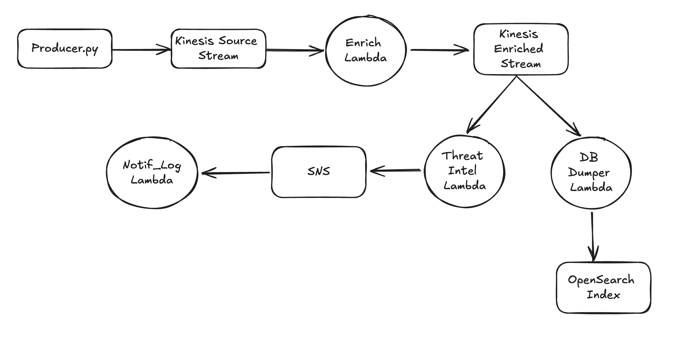
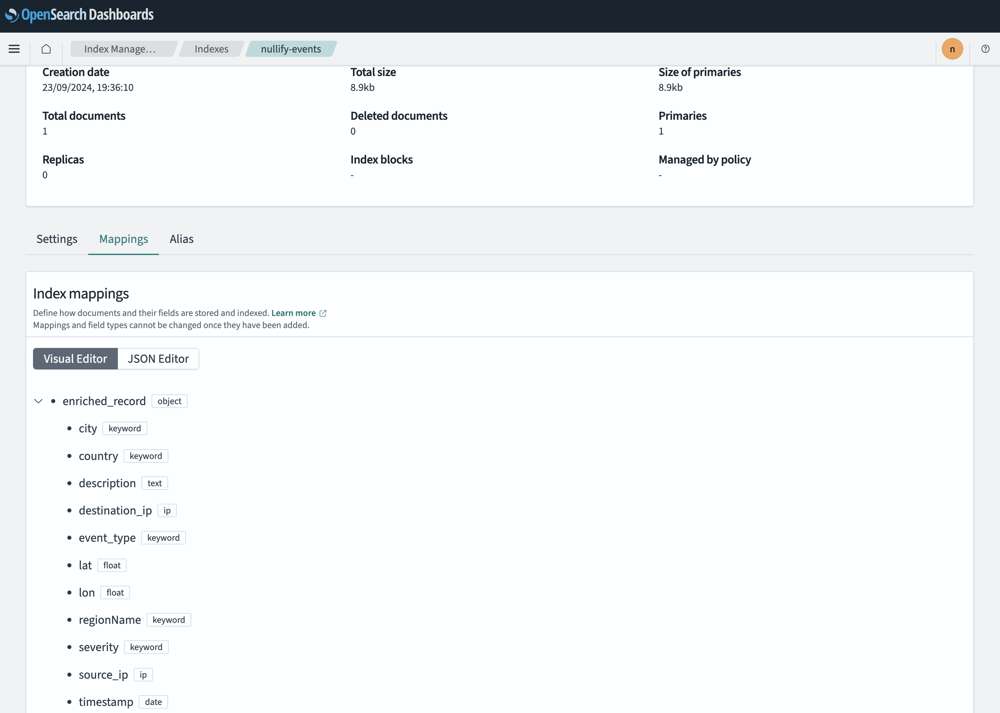

## Nullify Security Pipeline

This project is a security pipeline that ingests data from a Kinesis stream, enriches the data with geo-ip information, and then sends it to a backend for analysis.

### Prerequisites

- AWS Account
- AWS CLI
- Python 3.7+
- boto3
- requests
- base64
- dotenv
- urllib3
- requests_aws4auth

### Components

#### Producer
The `producer.py` script generates random security events and sends them to the Kinesis stream `nullify-source-stream`.

- **Event Types**: `login_attempt`, `port_scan`, `malware_detected`, `access_granted`, `access_denied`
- **Severity Levels**: `low`, `medium`, `high`
- **Malicious IPs**: `192.0.2.1`, `198.51.100.2`, `203.0.113.3`

#### Enricher Lambda
The `enricher.py` Lambda function enriches the incoming events with geo-IP information using the `ip-api.com` service and sends the enriched data to the Kinesis stream `nullify-enriched-stream`.

- **Geo-IP Information**: `country`, `regionName`, `city`, `lat`, `lon`

#### Threat Intel Lambda
The `threat_intel.py` Lambda function analyzes the enriched events to detect threats based on severity and known malicious IPs. If a threat is detected, it publishes the event to the SNS topic `nullify-threat-intel`.

- **Malicious IPs**: `192.0.2.1`, `198.51.100.2`, `203.0.113.3`

#### Notification Receiver Lambda
The `notif_rcv.py` Lambda function processes SNS notifications and logs the received messages.

#### OpenSearch Integration
The `my_lambda_function/lambda_function.py` Lambda function indexes the Kinesis stream data into an OpenSearch index `nullify-events`.

### Configuration

The `config.yaml` file contains the configuration for the Kinesis streams and SNS topic created using infra.ipynb.

## My Notes
* SNS redrive policy can be configured.
* producer can publish to API gateway endpoint, which can be configured to publish to Kinesis.
* lambda failure SNS notification can be configured.
* take region from env var.
* email notif not coming through 

## ToDo
[x] producer to publish to stream
[x] enrichment lambda 
[x] threat intel lambda
[x] SNS 
[x] SNS notif lambda
[ ] db_insert lambda

### Problems encountered
* Didn't deploy lambda.
* Lambda dependancy management. 
* Opensearch permissions issue.